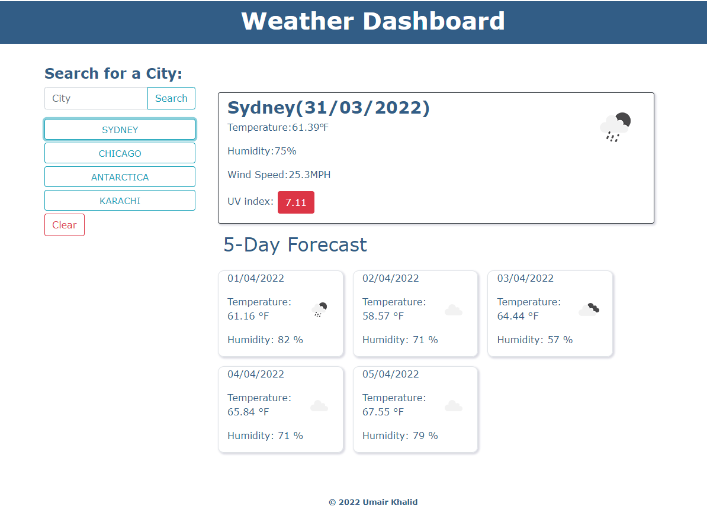

# Weather Dashboard

## Project Outline

Weather dashboard allows travellers to search a weather in a specific city before making travel arrangements. This app runs in the browser and feature dynamically updated HTML and CSS. Functionality is made possible via using the [OpenWeather One Call API](https://openweathermap.org/api/one-call-api) to retrieve weather data for cities. This Third-party API allow developers to access their data and functionality by making requests with specific parameters to a URL.

## User Story

```
AS A traveler
I WANT to see the weather outlook for multiple cities
SO THAT I can plan a trip accordingly
```

## Acceptance Criteria

```
GIVEN a weather dashboard with form inputs
WHEN I search for a city
THEN I am presented with current and future conditions for that city and that city is added to the search history
WHEN I view current weather conditions for that city
THEN I am presented with the city name, the date, an icon representation of weather conditions, the temperature, the humidity, the wind speed, and the UV index
WHEN I view the UV index
THEN I am presented with a color that indicates whether the conditions are favorable, moderate, or severe
WHEN I view future weather conditions for that city
THEN I am presented with a 5-day forecast that displays the date, an icon representation of weather conditions, the temperature, the wind speed, and the humidity
WHEN I click on a city in the search history
THEN I am again presented with current and future conditions for that city
```

## Mock-Up

The following image shows the web application's appearance and functionality:



## Link to Deployed Application

https://umairkhalid.github.io/weather-dashboard/

- - -
© 2022 Trilogy Education Services, LLC, a 2U, Inc. brand. Confidential and Proprietary. All Rights Reserved.
